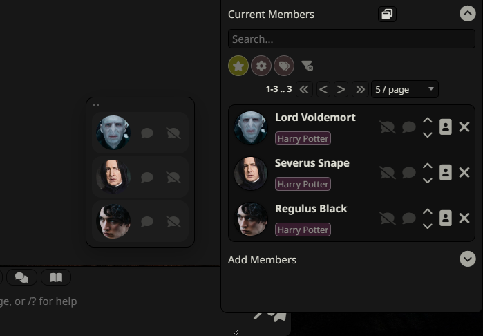
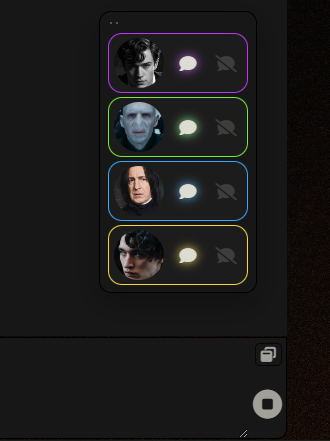

# Group Compact Panel

Compact floating panel for SillyTavern group chats.

It mirrors the standard group member actions in a smaller floating UI, so you can quickly:

- open a character card
- trigger `Speak`
- `Enable` or `Disable` automatic replies
- see which character is currently active
- see queue order colors at a glance
- drag the panel to a different place on the screen

## Images

 

## Version

Current extension version: `1.0.1`

The extension version is also stored in [manifest.json](./manifest.json).

## Files

- `index.js`: panel rendering, syncing with the standard group panel, drag behavior, and saved position
- `style.css`: compact panel layout and visual states
- `manifest.json`: extension metadata and activation hook
- `README.md`: extension overview and usage notes

## Installation

1. Open SillyTavern and go to **Extensions**.
2. Click **Install Extension**.
3. Enter the repository URL:
   [https://github.com/cloudmel/sillytavern-group-compact-panel](https://github.com/cloudmel/sillytavern-group-compact-panel)
4. Click **Install**.

## How It Works

The compact panel proxies actions from the standard `#rm_group_members` list instead of reimplementing them.

This keeps behavior aligned with the built-in group panel:

- avatar click opens the standard character management flow
- `Speak` triggers the same standard action button
- `Enable` and `Disable` trigger the same standard action buttons
- queue state is read from the standard group member DOM state
- queue colors are assigned by queue position in the compact panel itself

The panel listens for group and chat changes, and also watches the standard group member list with a `MutationObserver` so queue highlights stay in sync during generation.

## Dragging

The panel can be repositioned by dragging the small handle at the top-left.

- position is saved in `localStorage`
- position is clamped to the viewport
- normal avatar and action button clicks are unaffected

## Notes

- Queue colors follow queue position: active `#1` is green, then queued members use yellow, blue, purple, and orange for the next visible positions.
- The panel is hidden when no group is selected or when the current group has no members.
- The compact panel is intentionally minimal and depends on the standard group member panel for the underlying actions.
- The compact panel uses its own visual styling and does not rely on the standard `.group_member` styling for queue highlights.

## Acknowledgements

This extension was developed with the assistance of OpenAI Codex.

The project idea, UI design, feature planning, testing, and iterative refinement were created by the repository author.
